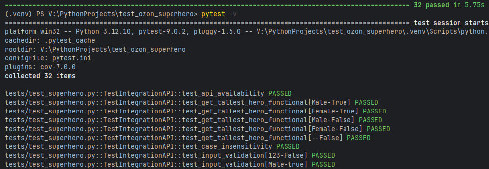
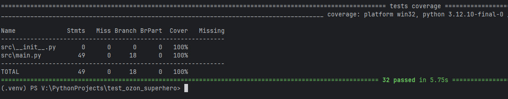

# Тестовое задание

Дано апи: https://akabab.github.io/superhero-api/ с информацией по супергероям. Необходимо написать функцию, которая 
принимает на вход пол и наличие работы (булево значение) и вернёт по этим критериям самого высокого героя.

Также для этой функции нужно написать все возможные тесты.

## Критерии приемки:
- должен быть файл README.md, где описано, как запустить тесты
- функция и тесты должны лежать в разных файлах
- должен быть файл для установки внешних пакетов, если они нужны
- функция и тесты должны быть рабочими и запускатья в том виде, в котором переданы на проверку
- если были использованы ИИ, то тестовое не проверяется и по нему не дается обратная связь
- не использовать mock-и, тестировать нужно именно Api
---

## Структура проекта

- `src/main.py` — основная логика приложения и работа с API.
- `tests/` — папка с тестами (интеграционные и юнит-тесты).
- `requirements.txt` — список зависимостей.
- `pytest.ini` — конфигурация для запуска тестов.
## Требования
- `Python 3.9+`
---
## Для установки зависимостей проекта
```
pip install -r requirements.txt
```

## Запуск тестов
- Для запуска всех тестов
```
pytest  -v
```
- Для запуска интеграционных тестов апи
```
pytest -m integration -v
```
<br>

## Отчет о покрытии (Coverage)
Для достижения полного покрытия (100%) бизнес-логики тесты разделены на два уровня:
- Интеграционные тесты: Проверяют реальное взаимодействие с живым API (требуется интернет).
- Юнит-тесты: Проверяют алгоритмы фильтрации и конвертации на локальных данных (фикстурах).

<br>
